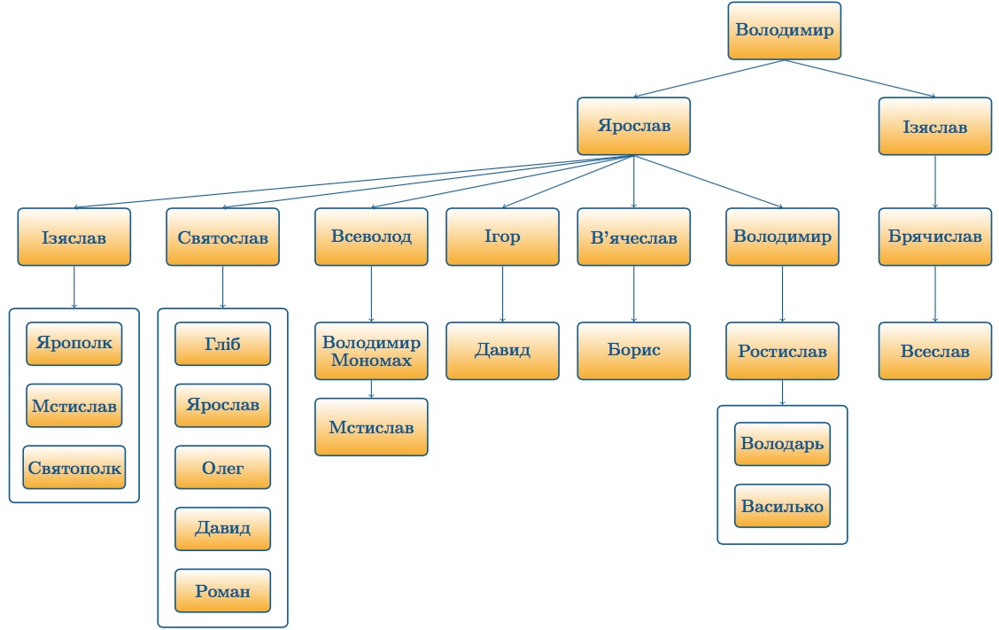

## Родовід: підрахунок рівнів
У генеалогічному дереві в кожної людини, крім родоначальника, є один з батьків (батько або мати). Кожному 
елементу дерева зіставляється ціле невід'ємне число, яке називається висотою. У родоначальника висота 
дорівнює 0, у будь-якого іншого елемента висота на 1 більше, ніж у його батька. Вам дано генеалогічне 
дерево, визначте висоту всіх його елементів.

**Формат введення.** Програма отримує на вхід число елементів у генеалогічному дереві N. Далі слідує N-1 
рядок, що задають одного з батьків для кожного елемента дерева, крім родоначальника.

**Формат виведення.** Програма повинна вивести список всіх елементів дерева в лексикографічному порядку. 
Після виведення імені кожного елемента необхідно вивести його висоту.

**Примітки**
Це завдання має розв'язання складності O(n), але вам достатньо написати розв'язання складності O(n²) 
(не рахуючи складності звернення до елементів словника).  

Приклад нижче відповідає частині генеалогічного 
дерева роду Рюриковичів.


**Приклади**
```
Тест 1
Вхідні дані:
29
Igor_Rurykovych Ruryk
Sviatoslav_Igorovych Igor_Rurykovych
Volodymyr_Velykyy Sviatoslav_Igorovych
Yaroslav_Mudryy Volodymyr_Velykyy
Izyaslav_Volodymyrovych Volodymyr_Velykyy
Bryachyslav Izyaslav_Volodymyrovych
Vseslav Bryachyslav
Izyaslav_Yaroslavovych Yaroslav_Mudryy
Sviatoslav_Yaroslavovych Yaroslav_Mudryy
Vsevolod Yaroslav_Mudryy
Igor_Yaroslavovych Yaroslav_Mudryy
Vyachyslav Yaroslav_Mudryy
Volodymyr_Yaroslavovych Yaroslav_Mudryy
Yaropolk Izyaslav_Yaroslavovych
Mstislav_Izyaslavovych Izyaslav_Yaroslavovych
Sviatopolk Izyaslav_Yaroslavovych
Glib Sviatoslav_Yaroslavovych
Oleg Sviatoslav_Yaroslavovych
Davyd_Sviatoslavovych Sviatoslav_Yaroslavovych
Roman Sviatoslav_Yaroslavovych
Yaroslav_Sviatoslavovych Sviatoslav_Yaroslavovych
Volodymyr_Monomach Vsevolod
Mstyslav_Volodymyrovych Volodymyr_Monomach
Davyd_Igorovych Igor_Yaroslavovych
Borys Vyachyslav
Rostyslav Volodymyr_Yaroslavovych
Volodar Rostyslav
Vasylko Rostyslav
Вивід програми:

Borys 6
Bryachyslav 5
Davyd_Igorovych 6
Davyd_Sviatoslavovych 6
Glib 6
Igor_Rurykovych 1
Igor_Yaroslavovych 5
Izyaslav_Volodymyrovych 4
Izyaslav_Yaroslavovych 5
Mstislav_Izyaslavovych 6
Mstyslav_Volodymyrovych 7
Oleg 6
Roman 6
Rostyslav 6
Ruryk 0
Sviatopolk 6
Sviatoslav_Igorovych 2
Sviatoslav_Yaroslavovych 5
Vasylko 7
Volodar 7
Volodymyr_Monomach 6
Volodymyr_Velykyy 3
Volodymyr_Yaroslavovych 5
Vseslav 6
Vsevolod 5
Vyachyslav 5
Yaropolk 6
Yaroslav_Mudryy 4
Yaroslav_Sviatoslavovych 6
Тест 2
Вхідні дані:

10
AQHFYP MKFXCLZBT
AYKOTYQ QIUKGHWCDC
IWCGKHMFM WPLHJL
MJVAURUDN QIUKGHWCDC
MKFXCLZBT IWCGKHMFM
PUTRIPYHNQ UQNGAXNP
QIUKGHWCDC WPLHJL
UQNGAXNP WPLHJL
YURTPJNR QIUKGHWCDC

Вивід програми:
AQHFYP 3
AYKOTYQ 2
IWCGKHMFM 1
MJVAURUDN 2
MKFXCLZBT 2
PUTRIPYHNQ 2
QIUKGHWCDC 1
UQNGAXNP 1
WPLHJL 0
YURTPJNR 2

Тест 3
Вхідні дані:
10
BFNRMLH CSZMPFXBZ
CSZMPFXBZ IHWBQDJ
FMVQTU FUXATQUGIG
FUXATQUGIG IRVAVMQKN
GNVIZ IQGIGUJZ
IHWBQDJ LACXYFQHSQ
IQGIGUJZ JMUPNYRQD
IRVAVMQKN GNVIZ
JMUPNYRQD BFNRMLH

Вивід програми:
BFNRMLH 3
CSZMPFXBZ 2
FMVQTU 9
FUXATQUGIG 8
GNVIZ 6
IHWBQDJ 1
IQGIGUJZ 5
IRVAVMQKN 7
JMUPNYRQD 4
LACXYFQHSQ 0
```