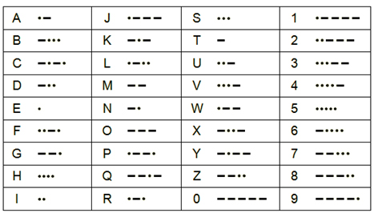

## Абетка Морзе
Написати програму, яка б переводила рядок англійською мовою в морзянку.

**Формат введення**  
Рядок, що складається з літер латинського алфавіту.  

**Формат виведення**  
Рядок, що відповідає коду Морзе вихідного рядка. Пробіл між словами замінити на 
знак `|:_..._:|`. Окремі символи розділити `|`.

**Таблиця кодування**  
  

**Приклади** 
```
Тест 1
Вхідні дані:
happy new year

Вивід програми:
....|.-|.--.|.--.|-.--||:_..._:|-.|.|.--||:_..._:|-.--|.|.-|.-.|
```