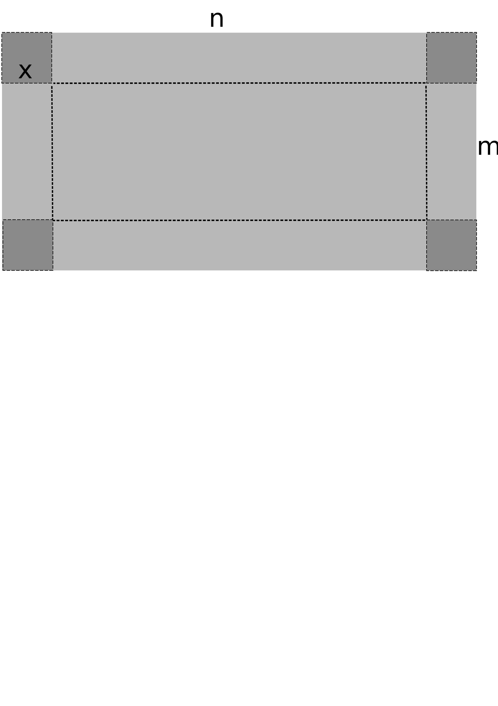

## Паралелепіпед максимального об'єму
Зварювальник Микола отримав замовлення зварити відкриту посудину у формі прямокутного 
паралелепіпеда з прямокутного листа металу розміру **n** x **m** метрів.  

***Технічне завдання замовника***:
1. У кожному куті листа металу вирізати одинакові квадрати з довжиною сторони **х** метрів (див. рисунок).
2. По лінії різу зігнути лист металу на кут 90 градусів з чотирьох сторін, утворивши таким 
чином борти посудини.
3. Зварити метал у місцях стикування бортів посудини.
4. Об'єм посудини повинен бути **максимальним**!

Допоможіть Миколі визначити розмір сторони квадрата **х**. Обчислення зробіть з точністю до
міліметрів. Напишіть рішення з використанням функції **maxVolume(length, width)**, де 
*length* та *width* розміри даного листа металу.

**Формат введення**  
Програма отримує на вхід два дійсних числа **n** та **m** (***0,2 < n, m < 3***) у рядок, розділені пробілом.

**Формат виведення**  
Виведіть одне число - відповідь на завдання.

**Приклади**
```
Тест 1
Вхідні дані:
2 1

Вивід програми:
0.211
```
[Демонстрація прикладу обчислень у табличному процесорі]()

 