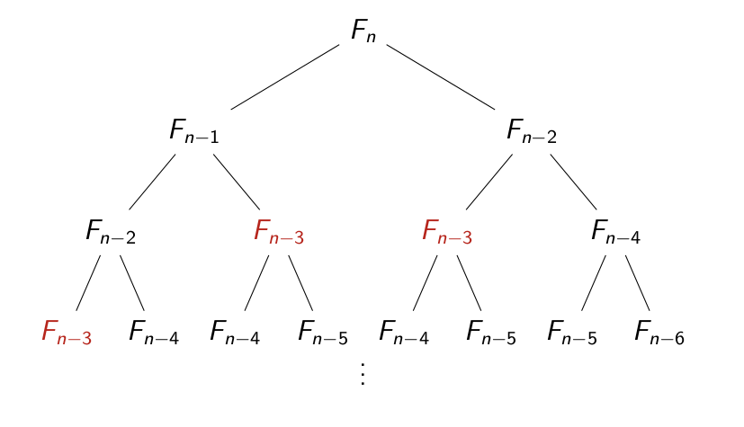

## Рекурсія. Основні поняття
**Рекурсія** — це процес визначення чогось у межах самого себе. Прикладом у фізичному світі може
бути розміщення двох дзеркал одне напроти одного. Будь-який об’єкт між ними відображатиметься 
рекурсивно. Доволі часто можна зустріти рекурсію у мистецтві, природі, тощо. Наприклад вікна готичного собору, 
суцвіття капусти романеско, листя папороті.  
```
|  |  |  |
|----------------------|--------------------------------|----------------|
| Листя папороті       | Спіральна рекурсія в природі   | Оригінальна банка для какао Droste 1904 року, розроблена Яном Міссетом (1861–1931) |
```
Але нас цікавить, що таке рекурсія в програмуванні, 
коли її треба застосовувати, які в неї переваги та недоліки.

### Визначення рекурсії
Рекурсія – це метод програмування, коли функція багаторазово викликає саму себе для вирішення певної 
задачі доти, доки не буде виконано умову завершення (базовий випадок). Умова завершення змусить 
функцію повернути значення або виконати будь-яку дію, або викликати переповнення стека і збій програми. 
Кожен виклик функції працює зі своїм унікальним набором даних і зупиняється, коли досягає базового випадку.  

**Теорема**. Довільний алгоритм, реалізований у рекурсивній формі, може бути переписаний в ітераційній формі
і навпаки.
#### Навіщо потрібна рекурсія в програмуванні  
Рекурсія дає змогу програмістам розбивати складні проблеми на підзадачі, а потім розв’язувати їх за допомогою однієї 
й тієї самої техніки. Це дає змогу уникнути використання складних структур керування, як-от цикли, і замість 
цього застосовувати чистий модульний підхід.

Рекурсія також дає змогу програмістам реалізовувати складні алгоритми, що вимагають повторюваних операцій, 
таких як бінарні дерева пошуку або послідовності Фібоначчі.

### Основні компоненти рекурсії
- **Базовий випадок** – умова, за якої рекурсія припиняється.
- **Рекурсивний випадок** – процес виклику функції самою собою з новими аргументами.

### Приклад простої рекурсивної функції
#### Приклад 1
Уявімо, що у нас є мільярд людей (це майбутні екземпляри функції), що сидять у ряд, і у кожного з них є 
аркуш паперу для запису (це його локальна пам'ять). Нам потрібно говорити числа та писати інструкцію для
людей так, щоб вони в результаті сказали всі числа з послідовності у зворотному порядку. Нехай кожен із них 
записуватиме на своєму аркуші лише одне число. Тоді інструкція для людини виглядатиме так:
1) Запиши назване число
2) Якщо число не останнє – "смикни" наступну за тобою людини, прийшла його черга працювати
3) Коли наступна за тобою людина сказала, що вона закінчила – назви записане число
4) Скажи тому, хто тебе "смикав" (попередня людина), що ти закінчив

Формалізуємо завдання. Нехай задається послідовність натуральних чисел, що закінчується нулем. Потрібно
розгорнути її за допомогою рекурсії.
```python
def rec():
     n = int(input())
     if n != 0:
         rec()
         print(n)
rec()
```
Ця функція здійснює дію (виведення числа) на рекурсивному спуску, тобто після рекурсивного виклику.

#### Приклад 2
Розглянемо завдання, де дії виконуються як на рекурсивному підйомі (стек викликів збільшується),
так і на рекурсивному спуску (стек викликів зменшується). Нехай дана послідовність, яка 
закінчується нулем. Необхідно вивести всі парні елементи послідовності у прямому порядку, а 
потім усі непарні елементи послідовності у зворотному порядку. Її рішення виглядатиме так:
```python
def rec():
     n = int(input())
     if n != 0:
         if n % 2 == 0:
             print(n)
         rec()
         if n % 2 != 0:
             print(n)

rec()
```
Кожен екземпляр функції зчитує у свою локальну змінну n число, якщо воно парне, то відразу
виводить його і запускає наступний екземпляр. Після того, як всі наступні екземпляри 
функції закінчили роботу (і вивели наступні непарні числа у зворотному порядку), функція 
виводить число, якщо воно було непарним.

#### Приклад 3
Розглянемо задачу про обчислення кількості замовлень деякого товару в **n** клієнтів. Уявімо, що ваша компанія 
займається гуртовою торгівлею товарів і співпрацює з замовниками (компаніями роздрібної торгівлі, магазинами).
Можливі два способи отримання замовлень від клієнтів:
1. Звертання до кожного клієнта (по телефону або через web-форму) по черзі та постійне сумування одиниць 
товару, отриманих при поточному звертанні до клієнта. Тоді реалізація задачі здійснюватиметься ітеративним 
способом за допомогою циклу for. 
```python
def marketing(n):
    sum_order = 0
    for client in range(1, n + 1):
        order = int(input(f'Введіть замовлення {client}-го клієнта: '))
        sum_order += order
    return sum_order

n = int(input('Введіть кількість клієнтів: '))
print('Сумарне замовлення:', marketing(n))
```

2. Звертання тільки до одного, наприклад останнього в списку, клієнта. Далі останній клієнт звернеться до 
передостаннього і т. д. останнім буде звернення другого клієнта до першого (першому вже немає до кого звертатись).
Після цього перший клієнт повідомляє своє замовлення другому. Другий клієнт додає власне замовлення до
замовлення першого і результат передає третьому. Третій четвертому, і т. д. аж до останнього в списку клієнта.
Останній клієнт буде знати загальну суму всіх замовлень і передасть вам. Реалізація задачі в такий спосіб 
здійснюється з використанням рекурсії.

```python
def marketing(n):
    order = int(input(f'Введіть замовлення {n}-го клієнта: '))
    if n == 1:
        return order
    return marketing(n - 1) + order

n = int(input('Введіть кількість клієнтів: '))
print("Сумарне замовлення:", marketing(n))
```
### Приклад 4
Розглянемо задачу про обчислення факторіала числа. Факторіалом цілого невід'ємного числа **n** називається 
добуток усіх натуральних чисел від **1** до **n** і позначається **n!** 
Ідея циклічної реалізації рішення полягає у безпосередньому обчисленні факторіалу числа за 
допомогою оператора циклу: 
$$f(n) = 1 · 2 · 3 · … · n$$
```python
def factorial(n):
    if n <=1 :
        return 1
    res = 1
    for i in range(2, n + 1):
        res *= i
    return res

number = int(input())
result = factorial(number)
print(result)
```

Якщо **f(n)** = **n!**, 
то має місце рекурентне співвідношення:
$$F(n) = \begin{cases} 
1,\ якщо\  n = 1\  або\ n = 0 \\  
n\ · \ F(n\ -\ 1),\ якщо\  n\ >\ 1 
\end{cases}
$$
яке є математичним означенням функції факторіала від цілого невід'ємного аргумента.
У даноу виразі в першому рядку записана умова, яка вказує, коли функції слід зупинити рекурсивні звернення
і яке значення при цьому повернути (базовий випадок).
У другому рядку визначається крок рекурсії (рекурсивне співвідношення) – спосіб обчислення **f(n)** через **f(n – 1)**.  

Наприклад, значення **f(3)** можна обчислити так:

$$f(3) = 3 · f(2) = 3 · 2 · f(1) = 3 · 2 · 1 = 6$$

Вочевидь, що при обчисленні **f(n)** слід здійснити **n - 1** рекурсивних викликів.
```python
def factorial(n):
    if n <= 1: # базовий випадок
        return 1
    return n * factorial(n - 1)  # рекурсивне співвідношення

number = int(input())
result = factorial(number)
print(result)
```
Тим, хто знайомий з методом математичної індукції, буде просто усвідомити рекурсію. Як і в
математичній індукції, в рекурсії має бути база (момент, коли функція не викликає іншу 
рекурсивну функцію) і перехід (правило, за яким вираховується результат за відомим 
результатом для меншого параметра). Наша функція підрахунку факторіалу робить лише свою 
роботу, але користується результатами чужої праці. Наприклад, якщо функція отримала на
вхід параметр 4, то має повернути 4 помножене на 3! (який буде порахований іншими функціями). У разі факторіалу аналогом "бази індукції" може бути 0! - за визначенням він дорівнює одиниці.

Ці приклади ілюструють загальну схему написання рекурсивних функцій: спочатку перевіряється
умова, коли функція має закінчитися, а далі робиться все решта. При цьому параметр повинен 
сходитися до бази. Зазвичай це означає, що при кожному наступному виклику рекурсії параметр
повинен зменшуватися.

### Проблеми рекурсії
- **Переповнення стеку** – занадто глибока рекурсія може викликати помилку (RecursionError).
- **Повторювані обчислення** – можуть уповільнювати виконання (як у випадку з числами Фібоначчі).

#### Приклад: Послідовність Фібоначчі
Послідовність Фібоначчі визначається так:
$$F(n) = \begin{cases} 
0,\ якщо\ n = 0 \\  
1,\ якщо\ n = 1 \\ 
F(n\ -\ 1)\ +\ F(n\ -\ 2),\ якщо\  n\ >\ 1 
\end{cases}
$$
Таблиця перших 11-ти елементів послідовності Фібоначчі:

|n|0|1|2|3|4|5|6|7|8|9|10|
|-|-|-|-|-|-|-|-|-|-|-|--| 
|F(n)|0|1|1|2|3|5|8|13|21|34|55|

**Завдання**: за відомим номером **n** обчислити **F(n)** - **n**-ий елемент послідовності
Фібоначчі.  

Слідуючи означенню, можемо написати наступне рекурсивне рішення
```python
def fibonacci(n):
    if n == 0:
        return 0
    elif n == 1:
        return 1
    return fibonacci(n - 1) + fibonacci(n - 2)

n = int(input())  # Введемо 9
print(fibonacci(n))  # Виведе 34
```
Спробуйте обчислити **F(40)**.  
Виникає запитання: ***чому так довго програма робить обчислення?***  
Розглянемо дерево рекурсивних викликів.

Як бачимо, одні і ті ж значення обчислюються декілька разів, що є однією з причин того, що 
рекурсивне рішення таке повільне для **n > 30**.
#### Оптимізація рекурсії: мемоізація
Мемоізація зменшує кількість повторних обчислень за допомогою кешування. У даному прикладі 
кешування здійснюється з використанням словника **memo**:
```python
def fibonacci(n, memo={}):
    if n in memo:
        return memo[n]
    if n == 0:
        return 0
    elif n == 1:
        return 1
    memo[n] = fibonacci(n - 1, memo) + fibonacci(n - 2, memo)
    return memo[n]

n = int(input())  # Введемо 40
print(fibonacci(n))  # Виведе 102334155
```
**Проблема початкового підходу:**  
- В оригінальному рекурсивному рішенні одна й та ж функція **fibonacci(n)** викликається багаторазово для 
однакових значень **n**.  
- Це призводить до експоненційної складності $O(2^n)$, що неефективно.

**Що таке мемоїзація?**  
- Це техніка кешування раніше обчислених значень, щоб не виконувати зайві обчислення.  
- Ми використовуємо словник **memo**, де зберігаємо вже знайдені значення.

**Як працює покращене рішення?**  
- Якщо значення **fibonacci(n)** вже розраховане (є в **memo**), воно повертається одразу.  
- Якщо **n** ще не було в словнику, функція рекурсивно обчислює **fibonacci(n - 1)** і **fibonacci(n - 2)**, 
а потім зберігає результат у **memo**.
- Завдяки цьому кожне значення **fibonacci(n)** обчислюється лише один раз.

**Часова складність покращеного алгоритму:**  
- Завдяки кешуванню отримуємо $O(n)$ замість експоненційної $O(2^n)$, що суттєво покращує швидкість.

Цей підхід дозволяє швидко знаходити числа Фібоначчі навіть для великих значень **n** без зайвих 
обчислень.

### Рекурсія vs Ітерація
Ітеративний підхід зазвичай ефективніший щодо пам'яті та продуктивності, але рекурсія може бути кориснішою 
у випадках, коли проблему природніше формулювати рекурсивно (наприклад, обходи дерев і графів).

### Переваги та недоліки рекурсії
#### Переваги рекурсії
- Стислість і зрозумілість коду.
- Висока продуктивність на рекурсивних завданнях.
- Ефективність використання пам’яті.
- Функціональне програмування за допомогою рекурсій.
- Простота використання.

#### Недоліки рекурсії
- Можливість переповнення стека.
- Низька продуктивність на багаторівневих завданнях.
- Складніша реалізація.
- Неуніверсальність застосування.
- Підходить не для всіх мов програмування.
- Підходить не для всіх середовищ через можливі проблеми з пам’яттю.

### Коли варто використовувати рекурсію, а коли не варто
#### Коли використовувати рекурсію:
- Рекурсія – гарний вибір, коли проблему можна розбити на більш дрібні підзадачі, які можна 
розв’язати одним і тим самим методом.
- Рекурсія часто використовується у функціональному програмуванні, оскільки дає змогу
компонувати та комбінувати функції.

#### Коли не треба використовувати рекурсію:
- Якщо розмір стека обмежений або рекурсія може бути занадто глибокою.
- Якщо розробник недостатньо досвідчений для створення багаторівневої рекурсії.
- Якщо мова розробки обмежена в підтримці рекурсії.
- Якщо в завданні передбачається обробка великих масивів даних.
