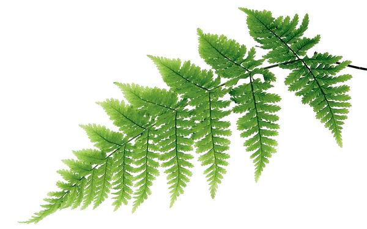
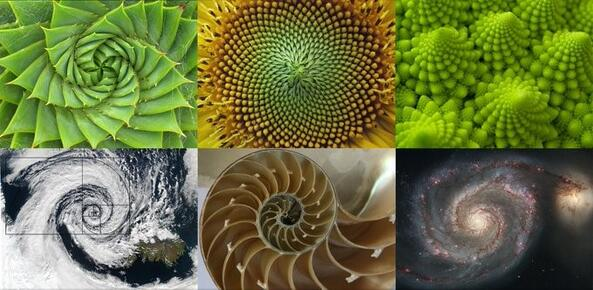

## Рекурсія. Основні поняття
**Рекурсія** — це процес визначення чогось у межах самого себе. Прикладом у фізичному світі може
бути розміщення двох дзеркал одне напроти одного. Будь-який об’єкт між ними відображатиметься 
рекурсивно. Доволі часто можна зустріти рекурсію у мистецтві, природі, тощо. Наприклад вікна готичного собору, 
суцвіття капусти романеско, листя папороті.  

|  |  |  |
|------------------------------|----------------------------------------|----------------|
| Листя папороті               | Спіральна рекурсія в природі           | Оригінальна банка для какао Droste 1904 року, розроблена Яном Міссетом (1861–1931)       |

Але нас цікавить, що таке рекурсія в програмуванні, 
коли її треба застосовувати, які в неї переваги та недоліки.

$$F(n) = \begin{cases} 
1,\ якщо\  n = 1\  або\ n = 0 \\  
F(n\ -\ 1),\ якщо\  n\ >\ 1 
\end{cases}
$$
